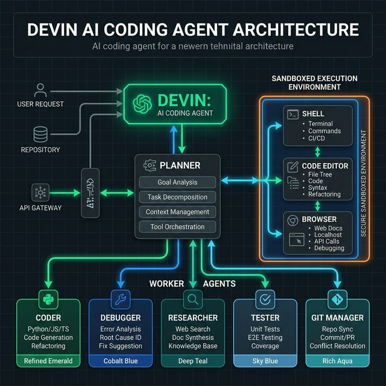
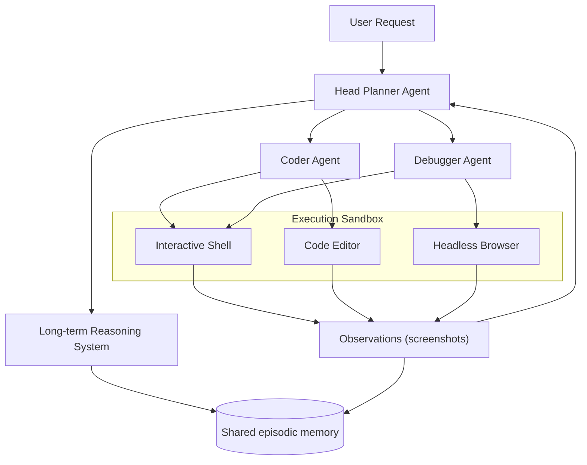
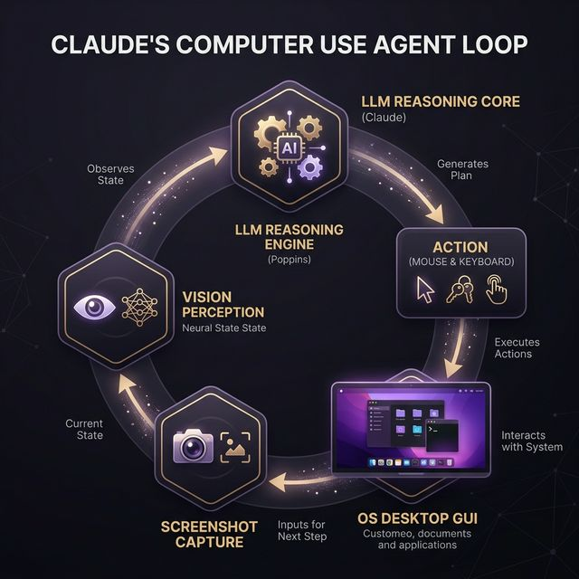
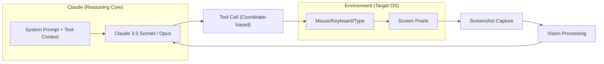

# Technical Report: Agent Architecture Design & Analysis

## Comparative Analysis of Devin (Cognition AI) and Claude Computer Use (Anthropic)

---

## 1. Introduction

The evolution of agentic AI has transitioned from simple chatbots to autonomous systems capable of executing complex workflows. This report analyzes two state-of-the-art agent products: **Devin** (by Cognition AI) and **Claude Computer Use** (by Anthropic). While Devin is a specialized, autonomous software engineer integrated into long-horizon development tasks, Claude Computer Use is a generalist agent designed to interact with any graphical user interface (GUI) by simulating human-like desktop operations.

---

## 2. PEAS Framework Analysis

The PEAS framework (Performance, Environment, Actuators, Sensors) allows for a systematic decomposition of an agent's operational space.

### 2.1 Devin (Autonomous Coder)

- **Performance Measure**: Successful resolution of real-world GitHub issues (SWE-bench), build stability, bug fixes, and deployment success.
- **Environment**: A sandboxed Linux machine with a shell, code editor (LSP), headless browser, and CI/CD tools.
- **Actuators**: Writing code, executing terminal commands (Bash), browser interactions (click/type), and Git version control operations.
- **Sensors**: Standard output/error from the shell, file content, browser DOM/screenshots, and linter/test results.

### 2.2 Claude Computer Use (Desktop Agent)

- **Performance Measure**: Accuracy in executing desktop tasks (e.g., filling web forms, moving files), adherence to user intent, and navigation safety.
- **Environment**: Full desktop operating system (Linux/Windows/macOS) with GUI applications.
- **Actuators**: Simulated human-like inputs: mouse clicks, scrolling, keystrokes, typing, and window resizing.
- **Sensors**: High-resolution screenshot captures, screen metadata (resolution), and accessibility tree data.

| Component | Devin | Claude Computer Use |
| :--- | :--- | :--- |
| **Domain** | Specialized (Software Engineering) | Generalist (Desktop Interaction) |
| **Stability** | High (Structured output) | Variable (Visual dependency) |
| **Logic** | Text-based protocols | Multimodal (Vision-based) |

---

## 3. Agent Architecture & Loop Model

Both agents follow the core loop: **Perceive → Reason → Plan → Act → Observe**.

### 3.1 Architecture Diagrams

#### Devin: Multi-Agent Orchestration

#### Claude Computer Use: Vision-Driven Loop

### 3.2 Reasoning Patterns

- **Devin**: Employs **Hierarchical Reasoning**. It breaks down a goal (e.g., "Add a search bar to the app") into a tree of sub-plans. It evaluates the success of each branch independently before moving to the next.
- **Claude**: Uses **Reactive ReAct Loop**. Upon perceiving a screenshot, it decides on the single "best" next action (e.g., "Click the login button at [120, 450]"). The "Observation" phase is almost entirely visual feedback from the state of the screen.

---

## 4. Memory, Tools, and Planning Mechanisms

### 4.1 Memory

- **Devin**: Uses highly efficient **Long-term Episodic Memory**. It maintains a "Project Wiki" that documents its own architectural discoveries. This persistent memory allows it to avoid repeating past debugging mistakes.
- **Claude**: Inherently **Stateless**. It relies on an orchestration layer to provide short-term context history in each API call. However, Anthropic's "Memory" feature allows users to persist style and high-level preferences across conversations.

### 4.2 Tool Use

- **Devin**: Uses a rich suite of "engineering actuators" (Shell, git, docker, npm). It can research third-party documentation via the browser and apply it instantly.
- **Claude**: Uses **Computer Control Tools**. These tools map abstract text commands like `mouse_move(x, y)` to native OS system events. It can also run terminal commands, but its primary differentiator is its visual UI manipulation.

### 4.3 Planning

- **Devin**: Proactive and Research-heavy. It spends time indexing a codebase before proposing a plan for review. This **"Interactive Planning"** ensures user alignment before autonomous execution.
- **Claude**: On-the-fly and Sequential. It usually plans only 1-2 steps ahead, effectively using the current screen state as its "canvas" for decision making.

---

## 5. Limitations and Challenges

### 5.1 Devin (Software-Centric)

1. **Context Fragmentation**: In massive repositories, the relevant code may exceed its active context window, causing "out-of-sync" plans.
2. **Execution Latency**: Its meticulous planning phase can be slow for simple tasks (e.g., renaming a variable).
3. **Hallucination in Debugging**: It can sometimes "debug" non-existent issues by misinterpreting terminal outputs.

### 5.2 Claude Computer Use (Vision-Centric)

1. **Fine-Granularity Errors**: Tiny buttons (like those in Excel) or dense UIs can lead to coordinate miscalculations and "ghost clicks."
2. **Screen Latency**: Capturing, transmitting, and processing screenshots leads to an interaction delay unsuitable for real-time tasks (e.g., gaming).
3. **Security Constraints**: As a vision agent, it is susceptible to **Visual Prompt Injection**—where an image on a page might trick the agent into performing destructive actions.

---

## 6. Conclusion

Devin and Claude Computer Use represent two distinct architectural paradigms. Devin is a **Vertical Specialist**, designed to deeply understand and manipulate the domain of software engineering through high-horizon planning. Claude is a **Horizontal Generalist**, bridging the gap between LLM reasoning and the myriad of human-designed graphical interfaces using multimodal vision.
For large-scale, autonomous development, Devin is superior. For workflows requiring cross-application orchestration (e.g., between an Excel sheet and a legacy CRM), Claude’s vision-driven approach is the industry benchmark.

---

---

**References:**

- *Anthropic (2024). Introducing Computer Use.*
- *Cognition AI (2024). Devin: The First AI Software Engineering Agent.*
- *Yao, S. et al. (2022). ReAct: Synergizing Reasoning and Acting in Language Models.*

---

**REPORT METADATA**

- **SYSTEM:** K.A.L.I (Kinetic Agentic Learning Intelligence)
- **DOMAIN:** Agentic Architecture Analysis
- **STATUS:** VERIFIED_DELIVERABLE_V1.0
